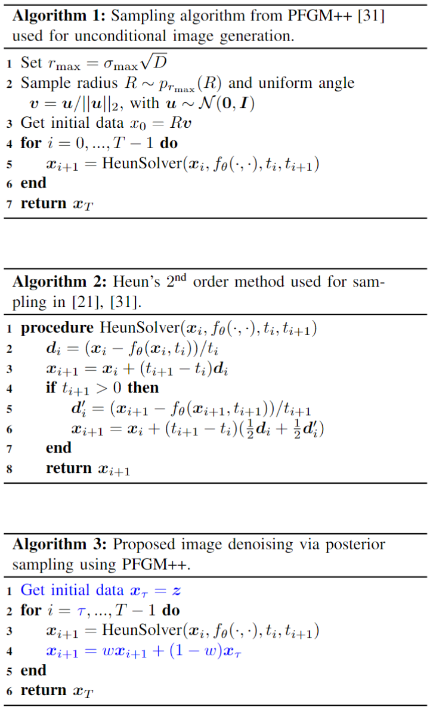

# Image denoising in photon-counting CT using PFGM++ with hijacked regularized sampling<br>

Pytorch implementation of the paper [Image denoising in photon-counting CT using PFGM++ with hijacked regularized sampling](https://arxiv.org/abs/)<br>
by Dennis Hein, Staffan Holmin, Timothy Szczykutowicz, Jonathan S Maltz, Mats Danielsson, and Mats Persson

Abstract: *Deep learning (DL) has proven to be an important tool for high quality image denoising in low-dose and photon-counting CT. However, DL models are usually trained using supervised methods, requiring paired data that may be difficult to obtain in practice. Physics-inspired generative models, such as score-based diffusion models, offer a unsupervised means of solving a wide range of inverse problems via posterior sampling. The latest in this family are Poisson flow generative models PFGM++ which, inspired by electrostatics, treat the $N$-dimensional data as positive electric charges in a $N+D$-dimensional augmented space. The electric field lines generated by these charges are used to find an 
invertible mapping, via an ordinary differential equation, between an easy-to-sample prior and the data distribution of interest. In this work, we propose a method for CT image denoising based on PFGM++ that does not require paired training data. To achieve this, we adapt PFGM++ for solving inverse problems via posterior sampling, by hijacking and regularizing the sampling process. Our method incorporates score-based diffusion models (EDM) as a special case as $D\rightarrow \infty$, but additionally allows a robustness-rigidity trade-off by varying $D$. The network is efficiently trained on randomly extracted patches from clinical normal-dose CT images. The proposed method demonstrates promising performance on clinical low-dose CT images and clinical images from a prototype photon-counting system.*

## Outline
This implementation is build upon the [PFGM++](https://github.com/Newbeeer/pfgmpp) repo which in turn builds on the [EDM](https://github.com/NVlabs/edm) repo. For transfering hyperparameters from EDM using the $r=\sigma\sqrt{D}$ formula, please see [PFGM++](https://github.com/Newbeeer/pfgmpp). Our suggested approach for image denoising via posterior sampling is shown in Algorithm 3, which adjustments to sampling algorithm in PFGM++ (Algorithm 1) highlighted in blue. Checkpoints for the [Mayo low-dose CT dataset](https://www.aapm.org/grandchallenge/lowdosect/) are provided in the [checkpoints](#checkpoints) section. 



## Training instructions from PFGM++
Our approach combines an unconditional generator with a hijacked and regularized sampling scheme to enable posterior sampling. Hence, the training process is identical as in PFGM++/EDM. Therefore we just restate the training instructions from the [PFGM++](https://github.com/Newbeeer/pfgmpp) repo:

You can train new models using `train.py`. For example:

```sh
torchrun --standalone --nproc_per_node=8 train.py --outdir=training-runs --name exp_name \
--data=datasets/cifar10-32x32.zip --cond=0 --arch=arch \
--pfgmpp=1 --batch 512 \
--aug_dim aug_dim (--resume resume_path)

exp_name: name of experiments
aug_dim: D (additional dimensions)  
arch: model architectures. options: ncsnpp | ddpmpp
pfgmpp: use PFGM++ framework, otherwise diffusion models (D\to\infty case). options: 0 | 1
resume_path: path to the resuming checkpoint
```

The above example uses the default batch size of 512 images (controlled by `--batch`) that is divided evenly among 8 GPUs (controlled by `--nproc_per_node`) to yield 64 images per GPU. Training large models may run out of GPU memory; the best way to avoid this is to limit the per-GPU batch size, e.g., `--batch-gpu=32`. This employs gradient accumulation to yield the same results as using full per-GPU batches. See [`python train.py --help`](./docs/train-help.txt) for the full list of options.

The results of each training run are saved to a newly created directory  `training-runs/exp_name` . The training loop exports network snapshots `training-state-*.pt`) at regular intervals (controlled by  `--dump`). The network snapshots can be used to generate images with `generate.py`, and the training states can be used to resume the training later on (`--resume`). Other useful information is recorded in `log.txt` and `stats.jsonl`. To monitor training convergence, we recommend looking at the training loss (`"Loss/loss"` in `stats.jsonl`) as well as periodically evaluating FID for `training-state-*.pt` using `generate.py` and `fid.py`.

## Image denoising using PFGM++

## Checkpoints
Available at [here](https://drive.google.com/drive/folders/1mxRpIQgyuI2iDrMGgYJX-wuxzoX3NM6j?usp=drive_link). 

## Preparing datasets 
The Mayo dataset from the AAPM low-dose grand challenge is available [here](https://www.aapm.org/grandchallenge/lowdosect/). 

## The instructions for set-ups from EDM repo
