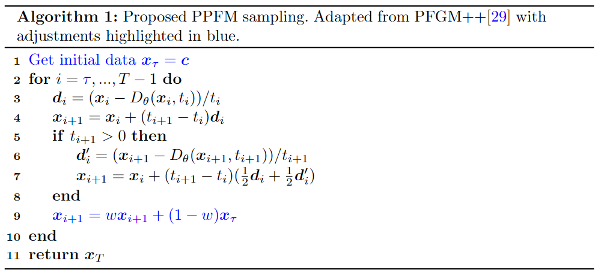

# Noise suppression in photon-counting CT using unsupervised Poisson flow generative models<br>

Pytorch implementation of the paper [Noise suppression in photon-counting CT using unsupervised Poisson flow generative models](https://arxiv.org/abs/2309.01553)<br>
by Dennis Hein, Staffan Holmin, Timothy Szczykutowicz, Jonathan S Maltz, Mats Danielsson, Ge Wang and Mats Persson

Abstract: *Deep learning has proven to be important for CT image denoising. However, such models are usually trained under supervision, requiring paired data that may be difficult to obtain in practice. Diffusion models offer unsupervised means of solving a wide range of inverse problems via posterior sampling. In particular, using the estimated unconditional score function of the prior distribution, obtained via unsupervised learning, one can sample from the desired posterior via hijacking and regularization. However, due to the iterative solvers used, the number of function evaluations (NFE) required may be orders of magnitudes larger than for single-step samplers. In this paper, we present a novel image denoising technique for photon-counting CT by extending the unsupervised approach to inverse problem solving to the case of Poisson flow generative models (PFGM)++. By hijacking and regularizing the sampling process we obtain a single-step sampler, that is NFE=1. Our proposed method incorporates posterior sampling using diffusion models as a special case. We demonstrate that the added robustness afforded by the PFGM++ framework yields significant performance gains. Our results indicate competitive performance compared to popular supervised, including state-of-the-art diffusion-style models with NFE=1 (consistency models), unsupervised, and non-deep learning-based image denoising techniques, on clinical low-dose CT data and clinical images from a prototype photon-counting CT system developed by GE HealthCare.*

## Outline
This implementation is build upon the [PFGM++](https://github.com/Newbeeer/pfgmpp) repo which in turn builds on the [EDM](https://github.com/NVlabs/edm) repo. For transfering hyperparameters from EDM using the $r=\sigma\sqrt{D}$ formula, please see [PFGM++](https://github.com/Newbeeer/pfgmpp). Our suggested approach for image denoising via posterior sampling is shown in Algorithm 1, with adjustments to sampling algorithm in PFGM++ (Algorithm 1) highlighted in blue. Checkpoints for the [Mayo low-dose CT dataset](https://www.aapm.org/grandchallenge/lowdosect/) are provided in the [checkpoints](#checkpoints) section. 



## Training instructions from PFGM++
Our approach updates smapling process of [PFGM++](https://github.com/Newbeeer/pfgmpp). You can train new models using `train.py`. For instance, to train PPFM with $D=128$ one runs 

```sh
python train.py --outdir=./uncond-runs --data=./datasets/train_mayo_1_alt-512x512.zip \
--pfgmpp=1 --aug_dim=128

data: data to be used (in .pt format)
pfgmpp: use PFGM++ framework, otherwise diffusion models (D\to\infty case). options: 0 | 1
aug_dim: D (additional dimensions)  

```
To get the two other models presented in the paper simply adjust `--pfgmpp` and `--aug_dim`
 
## Image denoising using PFGM++
Download pretrained weights and place in ./PPFM_mayo_1mm_weights/. Currently the generate_cond.py scripts requires dummy .dcm files in ./dicoms/ folder. One can easly adjust the code to circumvent this, however. To inference on the Mayo low-dose CT validation set using the best performing model ($D=64$) run: 
  ```zsh
  python generate_cond.py \
        --network=./PPFM_mayo_1mm_weights/D=64/training-state-003201.pt --batch=1 --data=val_mayo_1_alt \
--aug_dim=64 --steps=8 --hijack=1 --weight=0.7 --minmax train_mayo_1_alt_minmax --uncond_score=1

network: results used for inference 
data: data to be used (in .pt format)
steps: T (Algorithm 2) 
hijack: tau=T-hijack (Algorithm 2) 
weight: w (Algorithm 2) 
aug_dim: D (additional dimensions)
uncond_score: flag to get unconditional score function
```
For the $D \rightarrow \infty$ case, simply omitt the `--aug_dim` flag. 

## Checkpoints
Checkpoints for the Mayo low-dose CT dataset are available in links below. As with [PFGM++](https://github.com/Newbeeer/pfgmpp), most hyperparameters are taken directly from [EDM](https://github.com/NVlabs/edm). 
| Model                             | Checkpoint path                                              | $D$      |                           Options                            |
| --------------------------------- | :----------------------------------------------------------- | -------- | :----------------------------------------------------------: |
| ddpmpp-D-64              | [`uPPFM_mayo_1mm_weights/D=64/`](https://drive.google.com/file/d/1NnoNp-tGXFdSTFe_qchfWN8sXMnSaLAC/view?usp=drive_link) | 64  |      `--cond=0 --arch=ddpmpp --cbase=128 --ares=16,8,4 --cres=1,1,2,2,2,2,2 --lr=2e-4 --dropout=0.1 --augment=0.15 --patch_sz=256 --n_patches=1 --batch=32 --fp16=1 --seed=41 --pfgmpp=1 --aug_dim=64`       |
| ddpmpp-D-128             | [`uPPFM_mayo_1mm_weights/D=128/`](https://drive.google.com/file/d/1MRpeM4aIzXkOLa7PX4DnxliTZSp9l5Ck/view?usp=drive_link) | 128  |      `--cond=0 --arch=ddpmpp --cbase=128 --ares=16,8,4 --cres=1,1,2,2,2,2,2 --lr=2e-4 --dropout=0.1 --augment=0.15 --patch_sz=256 --n_patches=1 --batch=32 --fp16=1 --seed=41 --pfgmpp=1 --aug_dim=128`      |
| ddpmpp-D-2048             | [`uPPFM_mayo_1mm_weights/D=2048/`](https://drive.google.com/file/d/1sIsaRht6zSbSH5YnkR9PrQ0m9Nv8yS4m/view?usp=drive_link) | 2048  |      `--cond=0 --arch=ddpmpp --cbase=128 --ares=16,8,4 --cres=1,1,2,2,2,2,2 --lr=2e-4 --dropout=0.1 --augment=0.15 --patch_sz=256 --n_patches=1 --batch=32 --fp16=1 --seed=41 --pfgmpp=1 --aug_dim=2048`      |
| ddpmpp-D-inf (EDM)        | [`uPPFM_mayo_1mm_weights/D=infty/`](https://drive.google.com/file/d/14BfL5Y7p4pU5AtsEVenk2JB6SGJqZ9Lb/view?usp=drive_link) | $\infty$ |                   `--cond=0 --arch=ddpmpp --cbase=128 --ares=16,8,4 --cres=1,1,2,2,2,2,2 --lr=2e-4 --dropout=0.1 --augment=0.15 --patch_sz=256 --n_patches=1 --batch=32 --fp16=1 --seed=41 --pfgmpp=0`                   |

## Preparing datasets 
Datasets are stored in the same format as in [StyleGAN](https://github.com/NVlabs/stylegan3): uncompressed ZIP archives containing uncompressed PNG files and a metadata file `dataset.json` for labels. Custom datasets can be created from a folder containing images; see [`python dataset_tool.py --help`](./docs/dataset-tool-help.txt) for more information. Updated dataset_tool_cond.py to read in data from .npy format. `pt_to_np_mayo_1mm.ipynb` will take the data tensor in .pt and save in .npy format that can be processed by `dataset_tool_alt.py`. You can find the Mayo data from the AAPM low-dose grand challenge [here](https://aapm.app.box.com/s/eaw4jddb53keg1bptavvvd1sf4x3pe9h/folder/144226105715). 

```.bash
python dataset_tool_alt.py --source=./datasets_unzipped/train_mayo_1_alt/ \
    --dest=datasets/mayo_1mm_alt-512x512.zip
```

## Instructions for setting up environment (from EDM)
- Python libraries: See `environment.yml`for exact library dependencies. You can use the following commands with Miniconda3 to create and activate your Python environment:
  - `conda env create -f environment.yml -n edm`
  - `conda activate edm`
- Docker users:
  - Ensure you have correctly installed the [NVIDIA container runtime](https://docs.docker.com/config/containers/resource_constraints/#gpu).
  - Use the [provided Dockerfile](https://github.com/dennishein/pfgmpp_PCCT_denoising/main/Dockerfile) to build an image with the required library dependencies.
